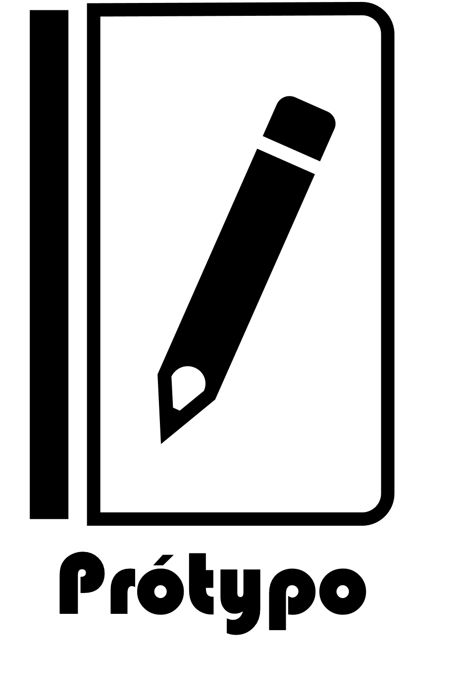

.. epigraph::
   “Documentation is a love letter that you write to your future self.”

   -- Unknown

.. centered::
    |Li Productions|

.. centered::
    |Program Logo|

.. centered::
    |Python Version| |Github| |Sphinx| |Style|

**TODO:** Description of your project goes here. [#]_

.. toctree::
   :maxdepth: 1
   :caption: Getting Started:

   pages/overview
   pages/installation
   pages/user_guide
   pages/development
   pages/metrics
   pages/authors

.. toctree::
   :maxdepth: 1
   :caption: References:

   pages/references

Indices and tables
------------------

* :ref:`genindex`
* :ref:`modindex` [#]_
* :ref:`search`

External
--------
* `Pdoc <_static/pdocs/index.html>`_

..
   Backlinks and references

.. |Python Version|
    image:: https://img.shields.io/badge/python-^3.10-blue?logo=python&logoColor=white
    :target: https://devguide.python.org/versions/

.. |Github|
    image:: https://img.shields.io/badge/CI-github-blue?logo=github&logoColor=white
    :target: https://docs.github.com/en/actions/quickstart

.. |Sphinx|
    image:: https://img.shields.io/badge/Sphinx-book%20theme-blue?logo=sphinx&logoColor=white
    :target: https://sphinx-book-theme.readthedocs.io/en/stable/

.. |Style|
    image:: https://img.shields.io/badge/code%20style-black-blue
    :target: https://black.readthedocs.io/en/stable/index.html

..
    Images

.. |Li Productions|
    image:: https://camo.githubusercontent.com/8a5a84adae2071b1d131af237bc0a15253b91bb86b2761bbd62ed3c3ac7aabea/68747470733a2f2f64726976652e676f6f676c652e636f6d2f75633f6578706f72743d766965772669643d31794674652d5241534363463161686b5967314a79626176692d67576a65386b70
    :width: 500
    :target: https://github.com/destin-v

..
   Footnotes
.. rubric:: Footnotes

.. [#] Replace with your own description.
.. [#] shows the structure and code of project
